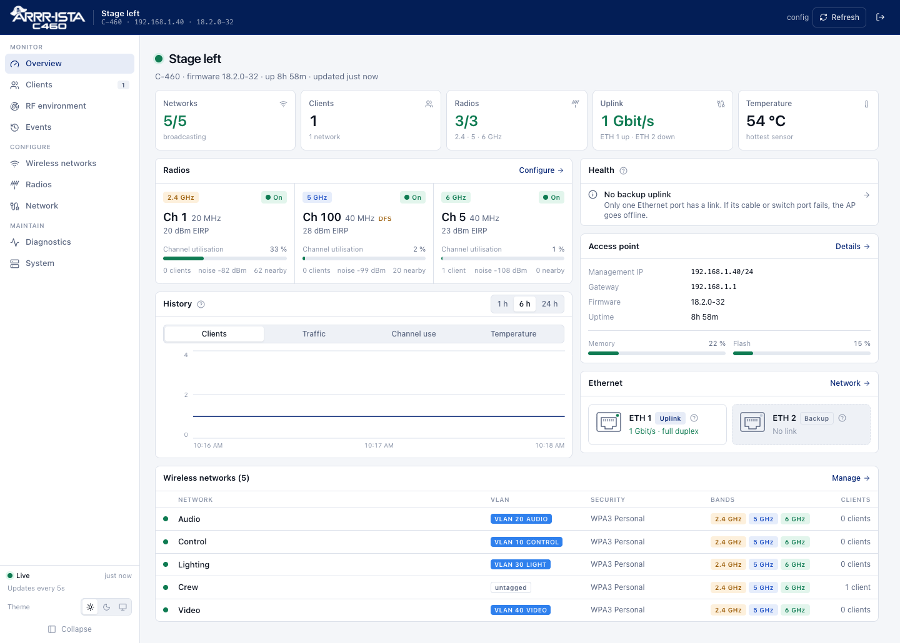
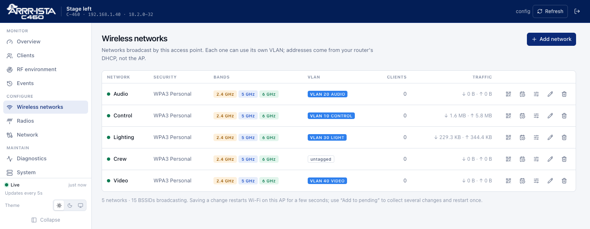
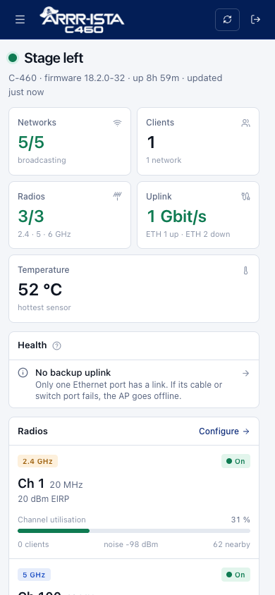
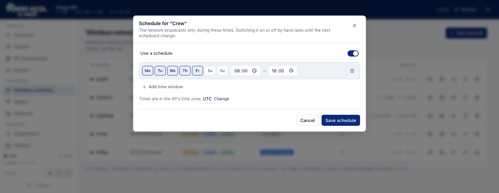
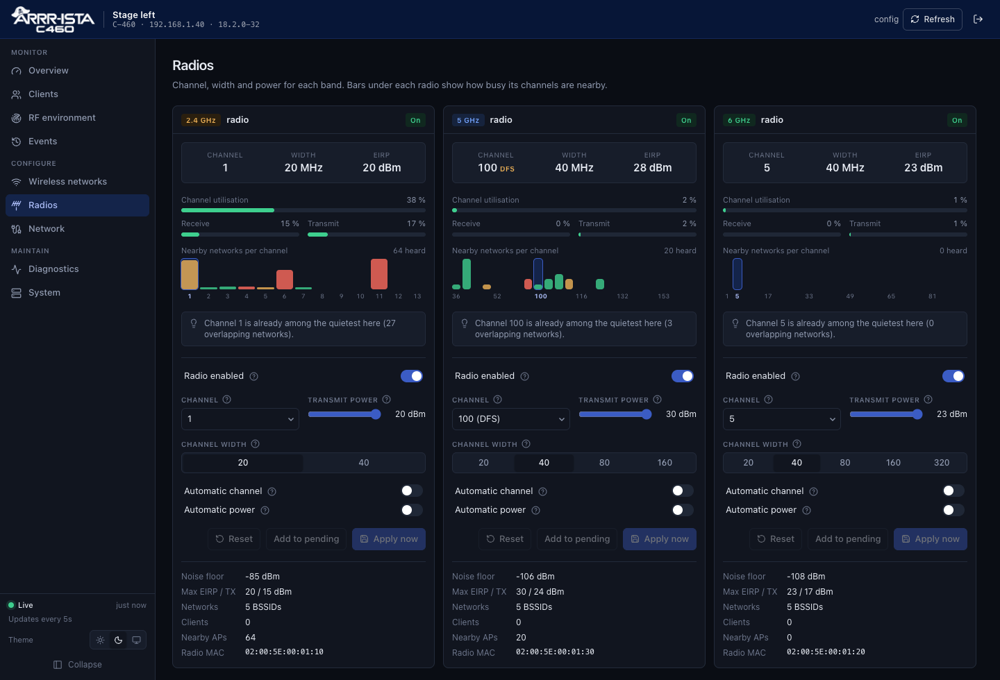

<p align="center">
  <picture>
    <source media="(prefers-color-scheme: dark)" srcset="docs/images/logo-white.png">
    
  </picture>
</p>

<p align="center">
  <b>A friendly local web interface for the Arista C-460 Wi-Fi 7 access point.</b><br>
  Runs on the access point itself. No controller, no cloud, no subscription.
</p>

<p align="center">
  <a href="#set-up-a-new-access-point">Set up a new AP</a> ·
  <a href="#what-you-get">Features</a> ·
  <a href="#everyday-use">Everyday use</a> ·
  <a href="#troubleshooting">Troubleshooting</a> ·
  <a href="#how-it-works">How it works</a>
</p>



The C-460 is normally managed from Arista's cloud. **arista-c460-webui** gives it a built-in web interface, like a standalone access point you buy in a shop: open `http://<ap-address>/` and manage it in the browser.

> [!WARNING]
> **Unofficial.** ARRR-ISTA is a parody brand for a community project. This project is not affiliated with, endorsed by or supported by Arista Networks. It changes files on the access point and uses interfaces the vendor does not document for this purpose. Use it at your own risk and keep a way to reach the AP's console while you experiment.

---

## What you get

| | |
|---|---|
| **See what's going on** | Health checks that point at problems (clock, power, temperature, busy channels, radar, weak clients, missing backup uplink, default password). 24-hour graphs for clients, traffic, channel use and temperature. Connected clients with signal history and roaming between bands. RF scan of nearby networks. Wi-Fi events and a log of every configuration change. |
| **Wireless networks** | Create and edit networks: WPA3, **WPA2/WPA3 mixed** for older devices, WPA2, Enhanced Open or open; 2.4/5/6 GHz; VLAN per network; client isolation; hidden networks. **Roaming between APs** (802.11r fast roaming, 802.11v, 802.11k, key caching), **band steering**, multicast and broadcast optimisation. **QR codes** for joining by phone, with a printable card. **Schedules** that turn a network on and off at set times. |
| **Radios** | Channel, width and power per band, automatic channel and power, and a **suggested quieter channel** based on the scan. Native **6 GHz Wi-Fi 7 at 160 or 320 MHz**, with verified operating state and restoration after restart/configuration changes. Wi-Fi 6/7 tuning: **OFDMA, MU-MIMO, BSS colouring, spatial reuse** and the automatic power range. Every advanced setting shows what the firmware is actually running. |
| **Change safely** | **Add to pending** collects several changes and applies them together, so Wi-Fi restarts once. A **read-only account** lets crew look without touching anything. **Backup and restore**, including copying the configuration to another AP. |
| **Network and system** | Management IP (static or DHCP), gateway, DNS and management VLAN. Time servers (one click to use your router) and time zone. LLDP switch discovery. SSH on/off, locate LED, safe restart, administrator login. |
| **Fit into your monitoring** | Read-only **SNMP** v1/v2c like your switches (system group, ifTable, ifXTable). Optional **Prometheus** `/metrics` with a token. |
| **Everywhere** | Light and dark themes, works on phones, HTTP and HTTPS. |

<table>
  <tr>
    <td width="66%"></td>
    <td width="34%" rowspan="2"></td>
  </tr>
  <tr>
    <td></td>
  </tr>
</table>



---

## Set up a new access point

This takes about 20 minutes per AP. You do steps 1–4 once on each AP; step 5 is a single command from your computer.

### What you need

- An **Arista C-460** with firmware **18.2.0-32** (other versions are untested).
- **PoE 802.3at** (PoE+) or better. 802.3af works but reduces radio power.
- A computer on the same network with **git**, **Go ≥ 1.26**, **Node.js ≥ 20**, **make** and an **SSH key** (`ls ~/.ssh/id_ed25519.pub`; create one with `ssh-keygen -t ed25519` if it is missing).
- Optional but recommended: a **USB serial console cable** (115200 baud, 8N1) in case the network is not reachable.

Get the code:

```bash
git clone https://github.com/Kortesaas/arista-c460-webui.git
cd arista-c460-webui
```

### 1. Connect the AP and find its address

Plug the AP into your switch or PoE injector (**ETH 1** is the usual uplink) and wait about three minutes for it to boot. It gets its address by DHCP; look for the new lease in your router, or for the MAC address printed on the label.

Sign in to the AP's command line with the factory login **`config` / `config`**, either over SSH or over the serial console:

```bash
ssh config@192.168.1.40
```

You now see the vendor CLI. All commands in steps 2–4 are typed there.

> [!TIP]
> On your computer, `deploy/unlock-commands.sh` prints all commands for steps 2–4 with your SSH key already filled in, ready to paste.

> [!TIP]
> Give the AP a fixed address in your router (a DHCP reservation for its MAC). That keeps `http://<ap-address>/` the same after every restart. You can also set a static address later in the web interface.

### 2. Keep the AP away from the cloud

Out of the box, the AP looks for Arista's cloud as soon as it has internet access. The cloud then switches the local mode off again and wipes the local configuration. Point management discovery at the AP itself:

```text
server discovery method ipdns pri 127.0.0.1 sec 127.0.0.1
```

Check it with `show server discovery` (both servers `127.0.0.1`) and `show device status` (**Not connected**).

> [!CAUTION]
> Never run `default server discovery` afterwards. It turns cloud discovery back on.

This only stops the cloud management connection. The AP and its Wi-Fi clients keep normal internet access.

### 3. Turn on local configuration (OpenConfig)

The web interface talks to the AP's own configuration service, which ships disabled. These two commands enable it and save the setting so it survives restarts:

```text
radartool radio 0 params ";. /opt/ap/configparser; cfg_set oc_enabled 1 /opt/sensor/sensor.conf; /opt/init.d/handle_openconfig_mode INIT;"
radartool radio 0 params ";/opt/sensor/scripts/encrypt_secret.sh -i /opt/sensor/sensor.conf -o /tmp/sensor-oc.enc && test -s /tmp/sensor-oc.enc && mv /tmp/sensor-oc.enc /opt/sensor/sensor.conf.enc;"
```

Check it with `show openconfig mode`.

### 4. Allow your computer to log in as root

The installer copies files over SSH as `root`, using your SSH key. On your computer, print your public key:

```bash
cat ~/.ssh/id_ed25519.pub
```

On the AP's command line, add it (paste your whole key line between the single quotes):

```text
radartool radio 0 params ";mkdir -p /root/.ssh; echo 'ssh-ed25519 AAAA…your key… you@laptop' >> /root/.ssh/authorized_keys; chmod 700 /root/.ssh; chmod 600 /root/.ssh/authorized_keys;"
```

Back on your computer, this must now print `root`, without asking for a password:

```bash
ssh root@192.168.1.40 whoami
```

### 5. Install the web interface

From the project folder on your computer, with your regulatory country (`DE`, `AT`, `CH`, `GB`, `US`…) and a name for the AP:

```bash
deploy/deploy.sh 192.168.1.40 --bootstrap --country DE --site-name "Stage left"
```

The script:

1. builds the web interface and checks that the AP is a C-460 with local configuration enabled,
2. **creates a private API user** for the web interface (it signs in once with the factory API login and replaces it, so that login stops working afterwards),
3. sets the AP's hostname and **regulatory country**. Changing the country can make the AP restart its radios or reboot once; just run the same command again afterwards,
4. asks you for the **web interface login**: username (default `config`) and a password of your choice,
5. installs and starts the service so it also starts after every reboot, and
6. runs the firmware's **boot-time trust check**, so you know a restart will not wipe the installation ([why this matters](#the-firmwares-boot-time-trust-check)).

### 6. First visit

Open `http://192.168.1.40/` (or `https://…`; your browser warns once about the self-signed certificate) and sign in. Then work through this short list:

1. **Overview → Health** lists anything that needs attention.
2. **Network → Time synchronisation → Edit**: click **Use router** (most routers answer NTP) and pick your **time zone**. Schedules and event times depend on it.
3. **Wireless networks → Add network** for each network. For a mix of new and old devices, use **WPA2/WPA3 Personal (mixed)**.
4. **System → Backup and restore → Download backup**. Enter a passphrase if the file should include the Wi-Fi passwords.

### More access points

Repeat steps 1–5 for each AP. Then, on the new AP, open **System → Backup and restore → Choose file…** and pick the backup from your first AP. Its networks, radios, advanced roaming and radio settings and time settings are copied over; the Wi-Fi passwords come along if the backup was made with a passphrase. For roaming between APs, use the same network names and turn on **Fast roaming (802.11r)** under each network's advanced settings; the roaming domain is derived from the network name, so it matches automatically. The new AP keeps its own name and IP address unless you choose otherwise.

---

## Everyday use

**Updating.** Get the latest version and run the installer again. Settings, logins and the change log are kept; the history graphs start over:

```bash
git pull
deploy/deploy.sh 192.168.1.40
```

**Several changes at once.** Every save restarts Wi-Fi on the AP for a few seconds. To change several networks or radios, use **Add to pending** in each dialog and then **Apply all** in the bar at the bottom.

**Crew access.** **System → Read-only account** creates a second login that sees everything but cannot change settings, see passwords or restart the AP.

**Who changed what.** **Events → Configuration changes** lists every change with user, address and details. Scheduled on/off switches appear there too.

**Monitoring.** Turn on **Network → Monitoring · SNMP** (use the same community as your switches) or **Prometheus**, which shows a ready-to-paste `prometheus.yml` snippet.

**Other installer options:**

```bash
deploy/deploy.sh <ap> --set-password            # reset a forgotten web UI password
deploy/deploy.sh <ap> --vlan-names vlans.json   # {"10": "Office", "20": "Guests"} shown next to VLAN ids
deploy/deploy.sh <ap> --check                   # only the boot-time trust check
deploy/deploy.sh <ap> --uninstall
deploy/deploy.sh --help
```

---

## Troubleshooting

| Problem | What to do |
|---|---|
| Browser says **connection refused** | Your browser may have switched to `https://` silently, or you are on a network that cannot reach the management address. Try both `http://` and `https://`, and from a device on the management network. |
| `deploy.sh`: **root SSH failed** | Repeat step 4 and check that `ssh root@<ap> whoami` works without a password. |
| `deploy.sh`: **OpenConfig agent certificate not found** | Local configuration is off. Repeat step 3. |
| `deploy.sh`: **Cloud discovery is still active** | Repeat step 2. The installer stops here on purpose: once the AP reaches the internet, the cloud would switch local mode off and wipe the setup. |
| **Bootstrap: sign-in to the OpenConfig agent failed** | The AP already has an API user (for example from an earlier setup). Use that user instead: put `{"username": "…", "password": "…"}` into `secrets/ap.secret.json` and run `deploy/deploy.sh <ap> --gnmi-credentials secrets/ap.secret.json`. |
| Settings are **gone after a reboot** | The firmware wiped its writable layer because it found an untrusted file. See [the boot-time trust check](#the-firmwares-boot-time-trust-check), redo steps 2–5, and always run `deploy/deploy.sh <ap> --check` before restarting after manual changes. |
| A WPA2/WPA3 network shows **activating mixed** | Normal for up to a minute after any change; until then only WPA3 devices can join. If it shows **WPA2 inactive**, hover over the badge for the reason. |
| **Schedule waiting for clock sync** | The AP's clock is not synchronised. Set a reachable time server under **Network**. |
| **Forgot the web interface password** | `deploy/deploy.sh <ap> --set-password` |

---

## How it works

```
browser ──HTTP :80 / HTTPS :443──▶ c460-webui (Go, on the AP) ──gNMI/TLS 127.0.0.1:8080──▶ AP OpenConfig agent ──▶ radios
                                         │
                                         └──▶ firmware's native configuration (management IP, time, LLDP, WPA2/WPA3 mixed)
```

The backend is a single static ARM64 Go binary (about 12 MB) with the React interface built in. It lives in `/opt/c460-webui/` on the AP.

- **Wireless and ordinary radio settings** use the AP's OpenConfig (gNMI) agent. Its TLS certificate is pinned from `/opt/openconfig/cert/agent.crt`. Every write re-sends the API user, because this firmware otherwise resets API authentication.
- **6 GHz Wi-Fi 7** uses the vendor's native configuration manager, with radio-only diff validation, operating mode/width verification and rollback. The service saves and restores the selected 160 or 320 MHz mode after configuration changes and at startup.
- **Management address, DNS and management VLAN** are written to the firmware's native `ifcfg-br0[.<VLAN>]` and discovery files, using the vendor's lock, and take effect at the next restart. The native CLI would reboot immediately, so it is not used for saving.
- **WPA2/WPA3 mixed mode** is not available through OpenConfig. Such networks are stored as WPA3 there, and the service switches the firmware's native setting to transition mode (`AP_SEC_MODE=7`) through the firmware's own apply script. It only does so after the firmware's diff tool confirms that nothing else changes and no restart is needed, and re-applies the setting after other configuration changes. If the service stops, these networks fall back to WPA3-only. Mixed mode works on 2.4 and 5 GHz; 6 GHz requires WPA3.
- **History, health checks and schedules** run inside the service. History is kept in fixed-size memory buffers (24 hours, one point per minute); the change log keeps the newest 300 entries on disk.

Tested on a C-460 with firmware **18.2.0-32**. More detail: [native feature findings](docs/native-features.md).

### The firmware's boot-time trust check

At every boot the firmware (`/etc/rc.d/fs_init`) checks its writable layer. If it finds anything it does not trust, it **deletes the entire writable layer** (`/overlay/upper`: local configuration mode, API users, SSH keys, this interface…) and boots the other firmware partition. It fails the check when:

- any **regular file** is in a protected directory: `/usr`, `/bin`, `/etc`, `/lib`, `/lib64`, `/sbin`, `/opt/init.d`, `/opt/lib`, `/opt/keys`, `/opt/scripts`, `/opt/sensor/scripts`, `/opt/dhclient`, `/opt/udhcpc` (symlinks are fine; exempt: `/etc/resolv.conf`, `/etc/profile`, `/usr/local/etc/`, `/lib/firmware/`). Python bytecode caches count too, so run any Python on the AP as `python3 -B`;
- `/opt/passwd`, `/opt/group`, `/opt/shells`, `/opt/sensor/sensor-shell`, `/opt/sensor/sensor.md5` or `/etc/shadow` differ from the image (they are measured into TPM PCR 7);
- a vendor file listed in `/opt/sensor/sensor.md5` was modified.

That is why everything this project installs lives in `/opt/c460-webui/`, with only symlinks in the protected service directories, and why the installer ends with a trust check. Before restarting after **any** manual change on the AP, run `deploy/deploy.sh <ap> --check`.

### Configuration file

`/opt/c460-webui/config.json` on the AP. Everything except the agent settings can be changed in the web interface.

| Key | Default | Meaning |
|---|---|---|
| `listen` | `:80` | HTTP listen address |
| `httpsListen` | `:443` | HTTPS listen address; `off` disables HTTPS |
| `tlsDir` | `tls/` next to the config | Self-signed certificate and key (generated on first start) |
| `pollSeconds` | `5` | Shared AP sampling interval, 1–60 seconds |
| `authFile` | `/opt/c460-webui/auth.json` | Logins (bcrypt hashes) |
| `hostname` | eth0 MAC with dashes | OpenConfig access-point key |
| `siteName` | — | AP name shown in the interface, SNMP and Prometheus |
| `vlanNames` | — | VLAN id → label |
| `gnmi.username` / `gnmi.password` | — | OpenConfig API user (created by `--bootstrap`) |
| `gnmi.address` | `127.0.0.1:8080` | Agent address |
| `timeZone` | `UTC` | IANA time zone for schedules |
| `schedules` | — | Per-network schedules |
| `snmp` | off | `enabled`, `community`, `location`, `contact`; `listen` (default `:161`) is file-only |
| `metrics` | off | `enabled`, `token` for `/metrics` |
| `changeLog` | `changes.json` next to the config | Change log file |

### Security notes

- Use the interface on a trusted management network. HTTPS uses a self-signed certificate. Sessions use HttpOnly, SameSite=Strict cookies; failed logins are rate-limited; changes require a JSON request.
- Wi-Fi passwords never reach the browser, except through the QR join code, which only administrators can open and which is logged.
- SNMP v1/v2c sends its community in clear text; enable it only on the management network.
- `config.json` contains the OpenConfig API password (mode 0600). Never commit AP credentials: `*.secret.json` and `secrets/` are gitignored.

---

## Development

```bash
make check                                     # go vet + TypeScript
make build                                     # web + ARM64 binary in build/
ssh -L 18099:127.0.0.1:80 root@<ap>            # tunnel to an installed backend
make dev                                       # Vite on http://localhost:5175, /api proxied to the tunnel
go test ./...                                  # backend tests (an SNMP interop test uses net-snmp if installed)
```

Backend: `backend/` (`gnmi.go` agent client, `state.go` state model, `api.go` HTTP API, `auth.go` sessions and roles, `mixed.go` WPA2/WPA3 mixed mode, `schedule.go`, `history.go`, `health.go`, `snmp.go`, `metrics.go`, `bootstrap.go`). Interface: `web/` (React, Tailwind). Installer and service script: `deploy/`.

### Repository layout

```text
backend/   Go HTTP API, AP integrations, and backend tests
web/       React interface and embedded frontend assets
deploy/    AP installer, service script, and firmware trust checks
docs/      Technical notes and feature coverage
Makefile   Build, development, and verification commands
go.mod     Shared Go module (with go.sum for dependency checksums)
```

Build the AP binary with `make build`; build only the backend with `make backend`
after building the frontend. For a local backend build, use
`go build -o build/c460-webui-local ./backend`. Run backend tests from the
repository root with `go test ./...`.

## Known limitations

- Wi-Fi 7 / 320 MHz controls affect the whole 6 GHz radio. A 6 GHz-only test SSID prevents band fallback; MLO is not configured. See [native feature verification](docs/native-features.md).
- Management configuration covers IPv4 only. DHCP mode makes the AP a DHCP client, not a server; addresses for Wi-Fi clients come from your router.
- The firmware chooses the active uplink itself (whichever Ethernet port has a link); there is no preferred-port setting.
- Some fields in the OpenConfig model are rejected by this firmware (for example DHCP-required and some 802.11r/v timers), so they are not offered.
- Blocking individual clients is not offered: the firmware's MAC filter cannot be reached through OpenConfig.
- History is kept in memory and starts empty after the service restarts.
- Firmware upgrades and factory resets remove the installation; repeat the setup afterwards.
